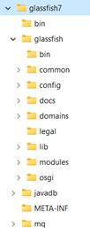
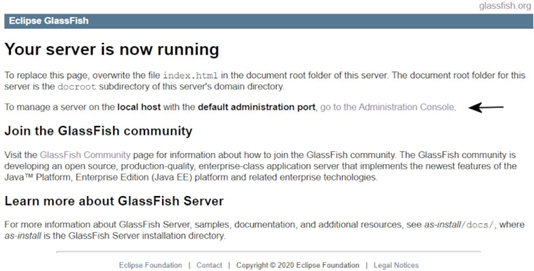

# Jakarta RESTful Web Services 3.1 Workshop

## Participant

### **Module 1: Set up the environment.**

To carry out all the tasks in this workshop you will need the following software. Each of these programs are available for Windows, macOS, and Linux. It is assumed that you know your computer well enough that it is not necessary to review how each program is installed. If not, then workshop presenters can assist you. The list of software is:

1. Java 17

2. IDE (optional)

3. Maven (latest version)

4. Glassfish 7.x.y (latest version of x and y)

5. Derby DB.

6. CURL (latest version)
   Information on where to find this software and installation information follows.

## Java SE 17

There are numerous distributions of Java other than from Oracle. One of Java’s strengths has been that from the perspective of a developer it does not mater which development environment you use. I recommend **Adoptium**, the new name for **AdoptOpenJDK**, that distributes the Eclipse distribution called **Temurin**, an anagram of the word ‘runtime’. At [htps://adoptium.net/](https://adoptium.net/) you will find **OpenJDK** builds for most operating systems and CPU platforms.

We are using Java 17 as the Jakarta 10 libraries can run on this version. This is a long-term support

version and Jakarta releases are usually tied to an LTS version.

Do not forget to set the **JAVA_HOME** environment variable and update the **PATH**.

Now let us install Maven.

## Maven

All the sample code is organized for use with the Apache Maven build tool. Most IDEs include Maven and so if you are using one you may not think it is necessary to download and install the command line version. It is. You can download Maven from [htps://maven.apache.org/download.cgi.](https://maven.apache.org/download.cgi) Like cURL and GlassFish it is distributed as a compressed file you can decompress anywhere. You must also add the path to the bin folder. It is recommended that you **use** the most recent version.

## IDE

This workshop does not assume that you will be using a specific IDE. Now let us install the Glassfish application server.

## Glassfish 7

There are numerous Java application servers. When Oracle maintained Java EE, the Glassfish server was the reference server. All other servers provided, at a minimum, the same services found in Glassfish. Today Glassfish is the Eclipse implementation of Jakarta EE. Instead of a reference server, Jakarta defines three profiles. These are platform, web, and core. Glassfish supports all the profiles. You may use another server such as Wild Fly or OpenLiberty but all workshop instructions assume Glassfish.

Visit [htps://glassfish.org/download](https://glassfish.org/download) and select the most recent version. In preparing this workshop the most recent version was **Eclipse GlassFish 7.0.5, Jakarta EE Platform, 10**. The version you can download may be different than 7.0.5 however for the purposes of this workshop any version 7.0.5 or greater will work.

The download is just a compressed file that you decompress into whatever folder you desire. Here is the

folder structure of Glassfish after you have decompressed it.

Add the location of the **bin** folder, for example in Windows, **C:\\devapp\\glassfish7\\bin**, to your path. Open a terminal/console and enter in any OS::

To start GlassFish: asadmin start-domain

You should see as the last line of the output: Command start-domain executed successfully.

To stop GlassFish: asadmin stop-domain

You should see as the last line of the output: Command stop-domain executed successfully.

You can now test Glassfish by opening your browser and entering in the address bar **localhost:8080**. You should see:

With the server running, visit the Administration Console by clicking on the link the arrow is pointing to. You should now see:

To stop the server, open a terminal in the same folder that you ran

To stop the server, open a terminal in the folder **glassfish7/glassfish/bin** folder and run the file **stopserv.bat** if your OS is Windows otherwise for Linux or macOS run **stopserv**. This assumes that you have updated your path. For Linux or macOS you may have to set the permissions for **stopserv** to be executable. You should see a message that looks like this:

Waiting for the domain to stop . Waiting finished after 60 ms.

Command stop-domain executed successfully.

Next up is the Derby database.

## Derby

The GlassFish server includes the Derby database. To start Derby go to **`[wherever you placed GlassFish]/glassfish7/javadb/bin`**, open a terminal/console in this folder and run the startNetworkServer script. This will start up Derby monitoring port 1527. The command line tool for Derby is if, also found in the bin folder.

Derby can also be downloaded from htps://db.apache.org/derby/derby_downloads.html. Next up is cURL, the command line htp tool.

### cURL

When you enter a URL into a browser you are always making a GET request. In learning about RESTful services, we will need make GET, POST, PUT, and DELETE requests. There are additional requests, but we will focus on these four. The cURL is a command line program that permits the sending of a REQUEST with any of the allowable verbs. This is an invaluable tool when developing RESTful services as you can test your service without first creating a client application. Visit [https://curl.se/download.html](https://curl.se/download.html) to download the appropriate compressed file. Decompress the file where you want it. Add the location of the bin folder to your path.

### Troubleshooting

A common problem is failing to properly configure the installation of Java. Here is how you can diagnose a configuration problem for Java. First, you can determine if Java is properly installed by entering in the console of any OS **java -version**. You should see something like:

**openjdk version "17.0.7" 2023-04-18**

**OpenJDK Runtime Environment Temurin-17.0.7+7 (build 17.0.7+7)**

**OpenJDK 64-Bit Server VM Temurin-17.0.7+7 (build 17.0.7+7, mixed mode, sharing)**

This workshop currently requires Java 17. Shown above is 17.0.7 but any 17.x.y should work. Versions of

Java from 18 and up are not supported. Java 21 will be supported with Jakarta 11.

If this information is incorrect or it cannot find the Java executable file, follow these steps to correct this problem.

### Windows

Open the console and enter the command **set**. You should find the environment variable JAVA_HOME that should be showing the folder Java was installed in. The **PATH** should include the full path to the bin folder in the Java folder.

**` JAVA_HOME=C:\devapp\jdk-17.0.7+7 PATH=%JAVA_HOME%\bin;%PATH%`**

If these are missing, they must be manually set in the **Environment Variables** dialog. In Windows 10 or 11 enter **environment** in the search box found on the task bar and select **Edit the system environment variables**. Here you can add or correct **JAVA_HOME** and **PATH**.

### Linux

Use the **printenv** command to verify **JAVA_HOME** and **PATH**. If they are missing or the assigned value is incorrect open a text editor and open your **.profile** file in your home directory. Add the follow line replacing **JAVA_HOME** with the location you installed Java in.

###### `export JAVA_HOME=/home/javadev/java/jdk-17.0.7+7`

Replace **javadev** with your login name.

If the **PATH** is incorrect, then add this line to **.profile**. 

###### `export PATH=\$JAVA_HOME/bin:\$PATH`

# macOS

Use the **printenv** command to verify **JAVA_HOME** and **PATH**. If they are missing or the assigned value is incorrect open a text editor and open your **.bash_profile** file in your home directory. Add the follow line replacing **JAVA_HOME** with the location you installed Java in.

**JAVA_HOME** with the location you installed Java in the file.

###### ` export JAVA_HOME=/Users/javadev/java/jdk-17.07+7/Contents/Home`

``Replace **javadev** with your login name.

If the **PATH** is incorrect, then add this line to **.profile**.

###### `export PATH=\$JAVA_HOME/bin:\$PATH`

# Module 1 Conclusion

This module is all about setting up the development environment. It is not just for Jakarta REST but for any Jakarta component you wish to use. You are almost ready to write your first service but first we need a task that we want to expose as a service. That is the topic of the next module.

