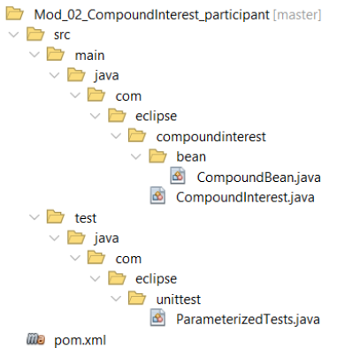

# Jakarta RESTful Web Services 3.1 Workshop

## Participant

### **Module 2: Coding the task that will become a service.**

In this module you will code classes that will calculate the value of money deposited into an account that will pay compound interest over a specified period at a specified interest rate. Here is the formula you will use:

**P** : is the principal amount deposited into a compound interest account

**r** : is the interest rate typically expressed as an annual rate

**n** : is the number of compounding periods (if compounded monthly, then the value is 12)

**t** : is the time the money will compound for. This is usually expressed in years and must be divided by the number of compounding periods, which, in this case, will be 12.

To simplify this task, you will use the mod_02_compoundinterest_presenter project.

with all the necessary components including unit tests. Think of this as a simplified example of Test-Driven Development or TDD.

### **The Project**

The project is Maven based as are all projects in this workshop. It has all the necessary source files but with some methods left empty. Your task is to complete the code that is missing. Here is the Maven layout of the project.

### **What needs to be done.**

You are free to write a different solution, but it should be able to pass the unit tests. Here are the descriptions of the components in the project. There are three files whose comments you need to read. The files are:

**CompoundInterest.java**

This is the file where you will implement the compound interest formula.

**CompoundBean.java**

This is the Java Bean to be used in the formula. It is complete.

**ParamerterizedTests.java**

This is a JUnit5 parameterized test class. It is complete.

You may feel that you could organize the code for the calculation and data in a better way. Feel free to do so. The goal is to implement a simple financial calculation with basic error checking so that in turn can become a web service.

The pom.xml file is also commented and should be reviewed. It contains a defaultGoal element that will clean, compile, and test the project.

**If you are running your code in a Locale that uses a comma rather than a decimal point, then change the @CsvSource in the unit test class.**

### **Your Task**

Implement the calculation of the formula shown above and have it pass the unit test. The workshop presenters will be happy to answer any questions that you may have.

