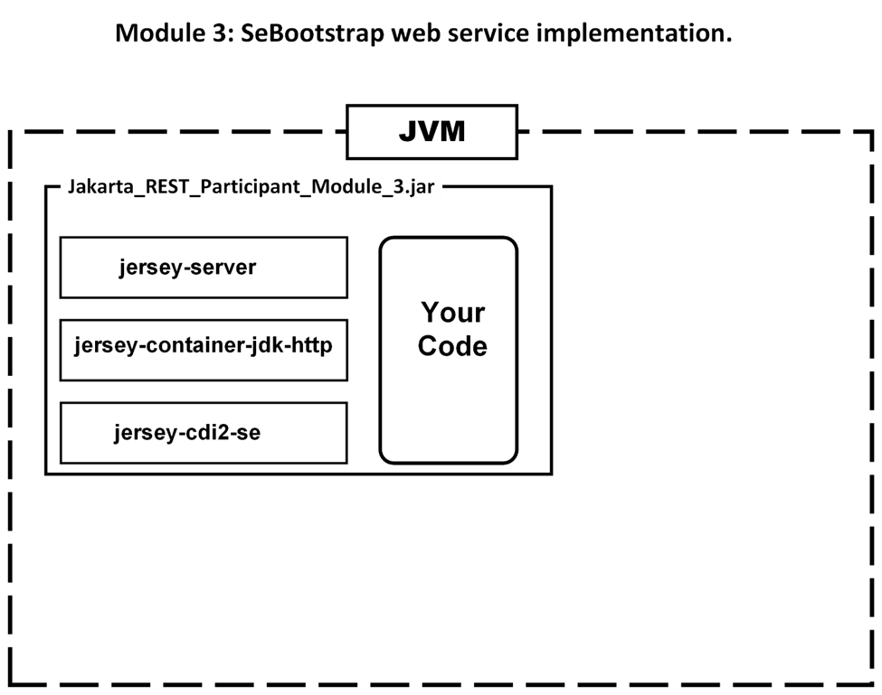
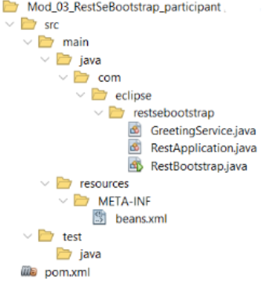

# Jakarta RESTful Web Services 3.1 Workshop

## Participant

### Module 3: SeBootstrap web service implementation.

****

In this module we will examine a simple web service that uses one of two embedded servers, Jersey or RestEasy. Jakarata EE 10 continues to simplify what is necessary to write a service. Let us begin by reviewing the program organization of `mod_03_restsebootsrap_participant`. Load the project into your IDE of choice or use a text editor to open or create files as described.

### The Project

While there is just one project, it employs Maven `<profiles>` to determine which library dependencies to use. By adhering to the Jakarta REST 3.1 API, we can use the Jersey or `RESTEasy` implementations without any changes to our source code. The project is named:

### `Mod_03_RestSeBootstrap_participant.`

Here is the project layout defined by Maven.



You will be writing the three class files shown in the `com.eclipse.restsebootstrap` package after this review of other files in this project.

### Let’s look at the beans.xml

This is a Java SE project, not a Jakarta Web project. There is one component normally associated with web applications and that is the beans.xml file. This is identical to the web version. Why do we need it? We require it if the project is using Context Dependency Injection or CDI.

The beans.xml file serves a simple purpose. By its existence in a project, it makes CDI, assuming all required dependencies are in place, available to the application. Here is the file:

```
<beans xmlns="https://jakarta.ee/xml/ns/jakartaee"
    xmlns:xsi="http://www.w3.org/2001/XMLSchema-instance"
    xsi:schemaLocation="https://jakarta.ee/xml/ns/jakartaee
    https://jakarta.ee/xml/ns/jakartaee/beans_4_0.xsd"
 bean-discovery-mode="annotated" version="4.0">
</beans>
```

It is the attribute `bean-discovery-mode` that interests us. The two common choices are all and annotated. The best practice uses `annotated`. At one time it was necessary to list all classes you wanted to be CDI capable but now annotations do this task.

### Let’s look at the pom.xml file

We will examine two sections of the pom file, the dependencies, and the build/plugin. Here are the dependencies for the Jersey based example. The pom file is complete.

```
<dependencies>
 <!-- The following three dependencies are required to use 
 SeBootstrap -->
   <dependency>
      <groupId>org.glassfish.jersey.core</groupId>
      <artifactId>jersey-server</artifactId>
      <version>3.1.2</version>
   </dependency>
   <dependency>
      <groupId>org.glassfish.jersey.containers</groupId>
      <artifactId>jersey-container-jdk-http</artifactId>
      <version>3.1.2</version>
   </dependency>
   <dependency>
      <groupId>org.glassfish.jersey.inject</groupId>
      <artifactId>jersey-cdi2-se</artifactId>
      <version>3.1.2</version>
   </dependency>
</dependencies>
```

If you use the RESTEasy library, then there are 4 dependencies.

```
<dependencies>
 <!-- These 4 dependencies are required for RESTEasy library -->
 <dependency>
      <groupId>org.jboss.resteasy</groupId>
      <artifactId>resteasy-core</artifactId>
      <version>6.2.4.Final</version>
   </dependency>
   <dependency>
      <groupId>org.jboss.resteasy</groupId>
      <artifactId>resteasy-undertow</artifactId>
      <version>6.2.4.Final</version>
   </dependency>
   <dependency>
 <!-- JSON dependency -->
      <groupId>org.jboss.resteasy</groupId>
      <artifactId>resteasy-json-binding-provider</artifactId>
      <version>6.2.4.Final</version>
   </dependency>
   <dependency>
 <!-- CDI dependency -->
      <groupId>org.jboss.weld.se</groupId>
      <artifactId>weld-se-shaded</artifactId>
      <version>5.1.0.Final</version>
      <type>jar</type>
   </dependency>
</dependencies>
```

We can have both sets of dependencies in the same pom file by creating two profiles. By changing the `activeByDefault`, using either true or false, you can select the profile to use. Try each profile.

```
   <profiles>
      <profile>
         <id>jersey</id>
         <activation>
            <activeByDefault>true</activeByDefault>
         </activation>
         <dependencies>
```

`            The Jersey dependencies go here`

```
         </dependencies>
      </profile>
      <profile>
         <id>resteasy</id>
         <activation>
            <activeByDefault>false</activeByDefault>
         </activation>
         <dependencies>
```

`            The RESTEasy dependencies go here`

```
         </dependencies>
      </profile>
   <profiles>
```

The plugin section, identical in `Jersey` and `RESTEasy`, focuses on the tasks that Maven will carry out. This is why it is not a section in the profiles. While Maven performs several tasks implicitly, these two plugins must be declared explicitly. The first is the `Assembly` plugin.

```
   <plugin>
      <!-- This plugin assembles all the dependencies and the compiled
           jar into a single executable file. -->
      <groupId>org.apache.maven.plugins</groupId>
      <artifactId>maven-assembly-plugin</artifactId>
      <executions>
         <execution>
            <phase>package</phase>
            <goals>
               <goal>single</goal>
            </goals>
            <configuration>
               <archive>
                  <manifest>
                     <mainClass>${exec.mainClass}</mainClass>
                  </manifest>
               </archive>
               <descriptorRefs>
                  <descriptorRef>jar-with-dependencies</descriptorRef>
               </descriptorRefs>
               <finalName>${project.artifactId}</finalName>
               <appendAssemblyId>false</appendAssemblyId>
            </configuration>
         </execution>
      </executions>
   </plugin>
```

This plugin will add all the libraries from your Maven repository to the final jar file. This allows for this web service to run on any computer requiring only that Java SE is installed on the computer.

The second is the `Exec` plugin.

```
   <plugin>
   <!-- Enables Maven to run the program as long as any previous
   goals, such as compile or test, were all successful. -->
      <groupId>org.codehaus.mojo</groupId>
      <artifactId>exec-maven-plugin</artifactId>
      <version>3.1.0</version>
      <configuration>
         <mainClass>${exec.mainClass}</mainClass>
         <arguments>
            <argument>-jar</argument>
            <!-- As Maven will produce an assembled and an
            unassembled jar file the following argument selects
            the assembled jar to be run by Maven -->
            <argument>target/${project.artifactId}.jar</argument>
         </arguments>
         <!-- The type of executable -->
         <executable>java</executable>
      </configuration>
   </plugin>
```

This plugin will run the jar file found in the target folder of the project if the goal is `exec:exec`.

### How do we code a RESTful web service.

In this first example we will code three classes to create a web service with an embedded server.

### RestApplication.java

Open the project and add the following in the project’s source code. File/class names are not significant. The first file is the `Application` class. Create a file named `RestApplication.java` in the `com.eclipse.restsebootstrap` package and enter the code as follows:

```
package com.eclipse.restsebootstrap;

import jakarta.ws.rs.ApplicationPath;
import jakarta.ws.rs.core.Application;
import java.util.Set;

@ApplicationPath("services")
public class RestApplication extends Application {
   @Override
   public Set<Class<?>> getClasses() {
      return Set.of(GreetingService.class);
   }
}
```

The annotation `@ApplicationPath` defines the path that follows the URL of the server that in our examples is localhost:8080. For example, `http://localhost:8080/services`.

A service that will run on an embedded server requires a class that extends Application and has at least one overloaded method,` getClasses()`, that will return a `List` of all classes that contain a method or methods to be called. As the `List` must be unique and without duplications, we use a `Set` rather than a plain `List`.

You can add additional service classes by separating each class name with a comma.

Next up is a class with the actual code for the service. This is the role of `GreetingService`.

```
GreetingService.java
```

Create a file named `GreetingService.java` in the `com.eclipse.restsebootstrap` package and enter the code as follows:

```
package com.eclipse.restsebootstrap;

import jakarta.ws.rs.GET;
import jakarta.ws.rs.Path;
import jakarta.ws.rs.QueryParam;
import java.time.LocalDateTime;

@Path("hello")
public class GreetingService {

   @GET
   public String sayCurrentTimeGet(@QueryParam("name") String person){ 
      return "Mod_03 GET: " + (person == null ||    
          person.trim().isEmpty() ?
          "Anonymous" : person)
          + " - Current date and time is " + LocalDateTime.now();
   }
}
```

The annotation `@Path` defines this class as a web service that is found at `/services/hello`. With just this annotation you can only have one method annotated with @GET, @POST, @PUT, and @DELETE. You can also use the @Path on individual methods. This allows for, as an example, multiple @GET methods in the same class if each one has a unique Path value. If you have an @Path at the class level, then it is combined with the individual method Paths.

In the method’s parameter list is the annotation @QueryParam. In parenthesis there must be the name of a field from an HTML form whose value you are assigning to the parameter. Unlike regular methods, you do not need to have any value for the parameter.

While this service just echoes the name and the current time, you can call upon any code in other methods or in other classes as needed.

`RestBootstrap.java`

This last class is just the home to the main method whose job is to configure and start the web service. You can place this startup code anywhere.

Create a file named `RestBootstrap.java` in the `com.eclipse.restsebootstrap` package and enter the code as follows:

```
package com.eclipse.restsebootstrap;

import jakarta.ws.rs.SeBootstrap;
import java.io.IOException;
import jakarta.ws.rs.core.Application;
import java.util.logging.Logger;

public class RestBootstrap {

   public static void main(final String[] args) 
       throws InterruptedException, IOException {

      Application app = new RestApplication();
      SeBootstrap.Configuration configuration = 
         SeBootstrap.Configuration.
         builder()
         .host("localhost")
         .port(8080)
         .protocol("http")
         .build();

      SeBootstrap.start(app, configuration);
      // Used when the service must run until you kill the process
      // Thread.currentThread().join();
      // Used when you want to end the service by pressing Enter
      System.out.println("Press Enter to end this process");
      System.in.read();
      System.exit(0);
   }
}
```

The first thing we need is an instance of a class that extends `Application`.

Next is the embedded server configuration.

The last step is to start the server. The `start` method runs the server as a daemon thread. This means that it ends when the main method end. This is why we have a `join`. One problem with this approach is that on Windows closing the process with a Ctrl-C or by closing the terminal/console does not stop the service. You will need to use:

```
taskkill /F /IM java.exe /T
```

Rather than join the thread we are using a `System.in.read();` to keep the thread alive until we press Enter. `System.exit` is then called, and this will stop the service on all platforms.

**Let’s run it!**

To compile and run your `Mod_03_RestSeBootstrap_participant` project to which you added the missing code, open a terminal/console in the root folder of the project and enter mvn. Unless there is an error in the build the embedded server will start up and keep running until you press the Enter key or kill the process. As we do not have a client program, you can test the service in one of two ways. The first is to use cURL.

```
curl http://localhost:8080/services/hello
```

should return with:

```
Mod_03 GET: Anonymous - Current date and time is 2023-08-07T15:31:40.157233400
```

Your date and time will be different. The name is Anonymous because we did not include a parameter. Let us do that now:

```
curl http://localhost:8080/services/hello?name=Ken
```

should return with:

`Mod_03 GET: Ken - Current date and time is 2023-08-07T15:33:53.596391400`

The second way, and only if the request is a GET, is to enter the URL in the address bar of a browser. If you enter:

```
http://localhost:8080/services/hello?name=Ken
```

The string returned to the console will now appear in the browser.

*The advantage of using cURL is that you can issue POST, PUT, and DELETE requests while with a browser you can only easily issue a GET.*

In the pom file set the jersey `<activateByDefault>` to false and the `resteasy` `<activateByDefault>` to true to see how the code will work with unchanged with either library. The remining modules will only use Jersey/GlassFish.

**What about the other request types?**

Add a POST, PUT, or DELETE request for the web service. You must first have a method annotated with one of these request types. When parameters come from query strings the body of each of these methods can be the same as the @GET method. Remember that you can have only one method per request type per @Path. If you need multiple @POST methods or any of the other three, then they must have a unique @Path just before the method signature or place each in its own class with @Path assigned to the class name.

The cURL command will be:

```
curl -i -X POST http://localhost:8080/services/hello
```

or

```
curl -i -X POST http://localhost:8080/services/hello?name=Ken
```

Let us now add our compound interest calculator as a service to this project.

## Turning the compound interest calculator (or your task) into a service.

Take the compound interest calculation and convert it to a service in `Mod_03_RestSeBootstrap_participant`. Do not add the unit tests. After running your updated version, you can test if your service works by using the cURL command as follows. Enter this as a single line right after you run your new version.

*If your Locale uses a comma rather than a period for a decimal point, then change the following to use a comma.*

```
curl "http://localhost:8080/services/compound?
  principal=100&annualInterestRate=0.05&compoundPerTimeUnit=12&time=5"
```

Notice that the `@ApplicationPath` is services and the service `@Path` is compound. The returned result is a `String` that shows all the input values and the final answer. In this case it is 128.34. You do not need to remove the `GreetingService.java` file. Just add a new class with the calculation. Don’t forget to update the `RestApplication` class’s `getClasses()` method. You will be delivering all input as `@QueryParams`.

In the next module we will look at hosting a web service on an application server such as GlassFish.
