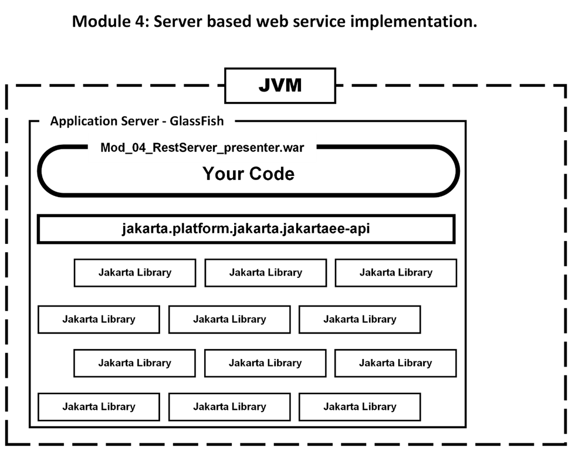
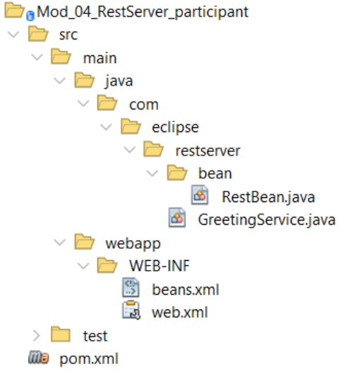
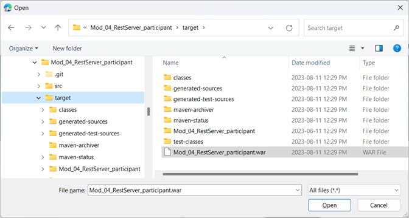

# Jakarta RESTful Web Services 3.1 Workshop

## Participant

**Module 4: Server based web service implementation.**

****

In this module we will deploy our compound interest RESTful service to an Application Server, in this example it is GlassFish. Please verify that you have installed GlassFish and it is running. The simple test to determine if all is well is to start your server and test the following URLs:

Welcome Page: <http://localhost:8080>

Admin Page: <http://localhost:4848>

The server admin page will be used to deploy and undeploy the web projects. If you are using an IDE, it may handle these tasks within the IDE.

The first step is to review the `mod_04_restserver_participant` project. Let us begin by reviewing the program organization.

### The Project

You create web services that will run on a application server as a web application. This means that such an application can also contain servlets, HTML, JSP and JSF files. Here is the Maven layout of the project:



The difference in this web service as compared to the Mod 3 example is that it assigns the `QueryParams` to a Java Bean and returns the result as a JSON string representation of the bean with the result.

Let us begin with the Maven pom file.

### Let’s look at the pom.xml file

The dependencies section is now quite short because all the Jakarta libraries are part of the GlassFish server. This means that you do not need to add them to the war file.

```
<dependencies>
   <dependency>
      <groupId>jakarta.platform</groupId>
      <artifactId>jakarta.jakartaee-api</artifactId>
      <version>${jakartaee-api.version}</version>
      <scope>provided</scope>
   </dependency>
</dependencies>
```

The build section no longer has the `Assembly` plugin as all libraries are available on the server. The element `<scope>`, set to provided, tells us that any library required for this dependency is already in the container, the application server. There is also no longer a `defaultGoal` of `exec:exec` because this code only runs in a server. This means we must deploy it to run it.

### Let’s look at the web.xml

In the days before annotations this XML file was where you configured the application. While annotations have reduced many of the once required entries in this file, this is a situation where you need it. Here is the web.xml file:

```
<web-app version="6.0"
   xmlns="https://jakarta.ee/xml/ns/jakartaee"
   xmlns:xsi="http://www.w3.org/2001/XMLSchema-instance"
   xsi:schemaLocation="https://jakarta.ee/xml/ns/jakartaee
   https://jakarta.ee/xml/ns/jakartaee/web-app_6_0.xsd">
   <servlet>
      <servlet-name>jakarta.ws.rs.core.Application</servlet-name>
   </servlet>
   <servlet-mapping>
      <servlet-name>jakarta.ws.rs.core.Application</servlet-name>
      <url-pattern>/services/*</url-pattern>
   </servlet-mapping>
</web-app>
```

As we need a class that extends `Applications`, the Jakarta framework supplies us with one in the form of the `jakarta.ws.rs.core.Application` servlet. The servlet-mapping allows us to have a path just as `@ApplicationPath` did in the `RestApplication.java` from `Mod_03_RestSeBootstrap_participant`. You do not require a class that extends Application. The application server will scan the project and identify all services by looking for `@Path`.

### Let’s look at the beans.xml

This file is unchanged from the embedded server version.

`Let’s look at the code.`

We are using the `GreetingService.java` from Mod 03 with two changes. The `QueryParams` values are stored in a bean and the return type is the `RestBean`. Let us begin by examining the bean.

**RestBean.java**

```
@RequestScoped
public class RestBean {

   private String name;
   private LocalDateTime theTime;
   private String serviceSource;

   public RestBean() {
      this.name = "";
      theTime = LocalDateTime.now();
      serviceSource = "";
   }

   public String getName() {
      return name;
   }

   public void setName(String name) {
      this.name = name;
   }

 // Getters and setters for the remaining fields

   @Override
   public String toString() {
      StringBuilder sb = new StringBuilder();
      sb.append("ServiceBean{");
      sb.append("name=").append(name);
      sb.append(", theTime=").append(theTime);
      sb.append(", serviceSource=").append(serviceSource);
      sb.append('}');
      return sb.toString();
   }
```

This is a standard Java Bean. As per the definition of a bean it has a default or no-parameter constructor. This is also a requirement of CDI. In the `beans.xml` file we declared that annotated classes are subject to CDI. In the case of this bean, proving the scope or lifetime of an object using `@RequestScoped` makes this bean available to CDI.

Let us look at the service.

**GreetingService.java**

```
@Path("hello")
public class GreetingService {

   @Inject
   private RestBean restBean;

   @GET
   public RestBean hello(@QueryParam("name") String name) {
      if ((name == null) || name.trim().isEmpty()) {
         name = "Anonymous";
      }
      restBean.setName(name);
      restBean.setTheTime(LocalDateTime.now());
      restBean.setServiceSource("GreetingService");
      return restBean;
   }
}
```

The bean used for the Compound Interest calculation was an ordinary Java Bean and it was necessary to instantiate it with new. Moving to CDI we no longer need to instantiate annotated classes and instead we `@Inject` them or use them on a JSF or JSP page. If there is already a CDI instantiated bean, the reference is assigned to the injected variable. If the bean has not been instantiated, then the injected variable is instantiated first.

### Deploying Mod_04_RestServer_participant

Build the project using Maven. Either you can do this in your IDE or from the command line by issuing a mvn in the root folder of the project.

Start your GlassFish server as shown in Module 1. Call up the admin panel of Glassfish by opening your browser and enter localhost:4848 as the URL. If you set a password for admin access, you will be asked for your username and password. When the admin screen comes up, select Applications in the Tree. You will next see the list of all deployed applications. This will be empty. Use the Deploy an Application button at the top of the deployed list. You should see:


Click on Choose File and navigate to the target folder of your project:



After selecting your war file and clicking on Open, the following displays:


Take note of the field titled Context Root. Although it states that the application name is used if there is no context root, this is not necessarily the case. To avoid any issues, enter:

```
/Mod_04_RestServer_participant
```

into the field:


Now let us see JSON in action.

### Instant JSON

So far, we have passed numbers and strings to the web services and received a string in return. This is fine for simple services but what we really want to do pass objects to a service and receive an object from the service. This is where JSON comes in.

To examine the output of this service, the `ResultBean` as a JSON string, you will enter in your browser:

```
http://localhost:8080/Mod_04_RestServer_participant/services/hello
```

or from the command line:

```
curl http://localhost:8080/Mod_04_RestServer_participant/services/hello
```

There is nothing else to do. When the return type is a JavaBean style object, this signals that you want the bean serialized using JSON. A return type of a String, a primitive wrapper such as Boolean, or a primitive type such as int will return the value and not JSON. This has nothing to do with the Request type such as GET and its friends. Rebuild and deploy this project. When you enter the line above in a browser or use cURL the result is now a JSON string.

```
{"name":"Anonymous","serviceSource":"GreetingService","theTime":"2023-08-11T14:59:34.5067359"}
```

Now let’s add our compound calculator.

### Now its your turn

Take the compound interest calculation service from the embedded server example and turn it into an Application Server hosted web service. Do not add the unit tests. As pointed out already, the equivalent of the `@ApplicationPath` as found in the web.xml `<url-pattern>` tag is `services`. The service class you write should have an `@Path("compound")`. Return the result as a String that is returned from the `CompoundBean’s toString()` method.

To test if your service works, use a cURL command as follows. Enter this as a single line.

```
curl "http://localhost:8080/Mod_04_RestServer_participant/services/compound?principal=100&annualInterestRate=0.05&compoundPerTimeUnit=12&time=5"
```

Change the return type to `CompoundBean` to see the result as a JSON string.

**Note***: Your data structure may be different from what you see in this text. If that is the case, then you must be certain to have in your data structure a default constructor. There is no need to change your code.*

Here is the JSON string.

```
{"annualInterestRate":0.05,"compoundPerTimeUnit":12.0,"principal":100.0,"result":"128.34","time":5.0}
```

If you use the -i switch in cURL you will see information about the server processing your service request, such as:

```
HTTP/1.1 200 OK
Server: Eclipse GlassFish 7.0.6
X-Powered-By: Servlet/6.0 JSP/3.1(Eclipse GlassFish 7.0.6 Java/Eclipse Adoptium/17)
Content-Type: application/json
Content-Length: 101
```

### @POST

But what if you wish to pass a JSON serialization of an object? Again, the coding is simple. There is one important rule concerning the GET request type. It was simple to return a JSON string by replacing the return type of String to the type of the class you wish to return. What you cannot do is replace the `QueryParams` with an object. An `Entity` is what we call an object used as a parameter to a web service method. You cannot use an `Entity` with GET. You can use it with POST.

Add the following method to your `CompoundInterest` web service class:

```
@POST
public CompoundBean postCompoundInterest(CompoundBean compoundBean) {
   calculateCompoundInterest(compoundBean);
   return compoundBean;
}
```

Use the method you wrote to perform the calculation. In my code it is called `calculateCompoundInterest`.

Compile and deploy the service. To test this, we need to send a JSON representative of the Entity. We cannot do this in the address bar of our browser. To test our code, we must use cURL.

Linux/MacOS:

```
curl -i -X POST --header "Content-Type: application/json" --data '{ "principal": 100.00,"annualInterestRate": 0.05, "compoundPerTimeUnit": 12.0, "time": 5.0, "result": "0.0" }' http://localhost:8080/Mod_04_RestServer_participant/services/compound
```

Windows must escape the quotation marks **\\**" and you cannot use the single quotation mark '.

```
curl -i -X POST --header "Content-Type: application/json" --data "{ \"principal\": 100.00, \"annualInterestRate\": 0.05, \"compoundPerTimeUnit\": 12.0, \"time\": 5.0, \"result\": \"0.0\" }" http://localhost:8080/Mod_04_RestServer_participant/services/compound
```

You must have a `--header` that shows the `Content-Type` as `application/json`. The JSON representation follows `--data`. All field names and string values must be inside quotation marks.

The expected outcome is:

```
HTTP/1.1 200 OK
Server: Eclipse GlassFish 7.0.6
X-Powered-By: Servlet/6.0 JSP/3.1(Eclipse GlassFish 7.0.6 Java/Eclipse Adoptium/17)
Content-Type: application/json
Content-Length: 101

{"annualInterestRate":0.05,"compoundPerTimeUnit":12.0,"principal":100.0,"result":"128.34","time":5.0}
```

Now its time to look at REST clients and how we can send and receive JSON strings to a service.
